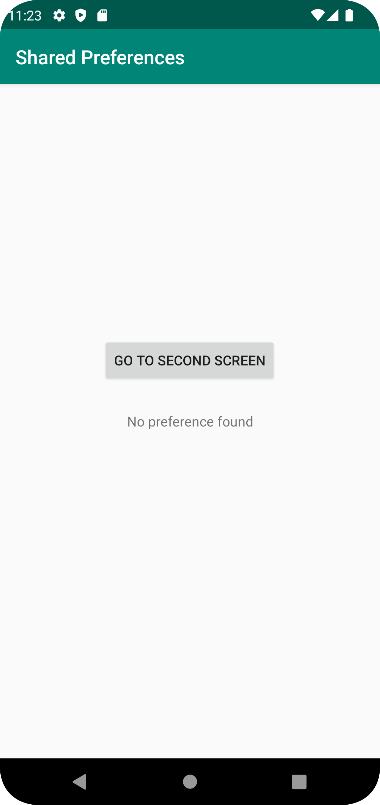
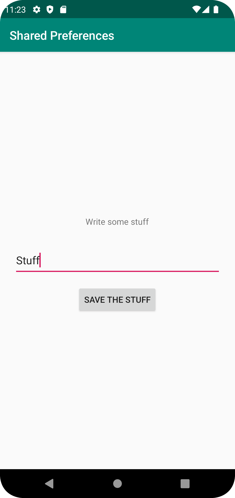
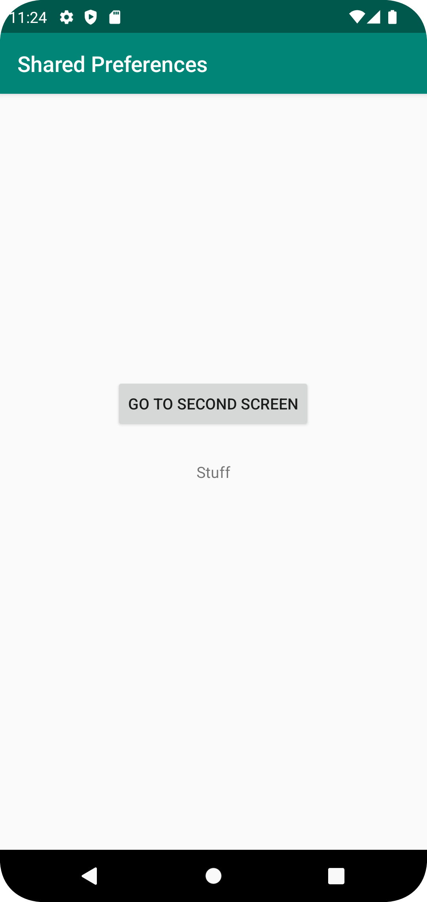

# Rapport

**Skriv din rapport här!**

Lade till en Second Activity och en knapp i MainActivity som öppnade Second.

```
    private Button btn;

    btn = (Button)findViewById(R.id.activityButton);
    
    btn.setOnClickListener(new View.OnClickListener() {
        @Override
        public void onClick(View view) {
            startActivity(new Intent(MainActivity.this, SecondActivity.class));
        }
    });
```

Lade till widgets i SecondActivity som redigerade och sparade text.

```
    <EditText
        android:id="@+id/editPrefText"
        android:layout_width="347dp"
        android:layout_height="52dp"
        android:ems="10"
        android:inputType="text"
        android:text="Stuff"
        app:layout_constraintBottom_toBottomOf="parent"
        app:layout_constraintEnd_toEndOf="parent"
        app:layout_constraintStart_toStartOf="parent"
        app:layout_constraintTop_toTopOf="parent" />

    <Button
        android:id="@+id/prefSaveBtn"
        android:layout_width="wrap_content"
        android:layout_height="wrap_content"
        android:text="Save the stuff"
        android:onClick="savePref"
        app:layout_constraintBottom_toBottomOf="parent"
        app:layout_constraintEnd_toEndOf="parent"
        app:layout_constraintHorizontal_bias="0.498"
        app:layout_constraintStart_toStartOf="parent"
        app:layout_constraintTop_toBottomOf="@+id/editPrefText"
        app:layout_constraintVertical_bias="0.054" />
```

Skapade shared preferences i Main och Second Activity. Skapade en Textview i main och en Editview i Second.

```
    private SharedPreferences preferenceRef;
    private SharedPreferences.Editor preferenceEditor;
    
    //Ligger i MainActivity
    private TextView prefTextView;
    
    //Ligger i SecondActivity
    private EditText newPrefText; 
```

För att redigera texten i SecondActivity och spara den i preferences användes savePref.

```
    @Override
    protected void onCreate(Bundle savedInstanceState) {
        super.onCreate(savedInstanceState);
        setContentView(R.layout.activity_second);

        preferenceRef = getSharedPreferences("SharedPref", MODE_PRIVATE);
        preferenceEditor = preferenceRef.edit();

    }

    public void savePref(View view) {

        newPrefText = new EditText(this);
        newPrefText = (EditText)findViewById(R.id.editPrefText);
        preferenceEditor.putString("AppPreferenceString", newPrefText.getText().toString());
        preferenceEditor.apply();

        newPrefText.setText("");

    }
```

För att visa den ändrade texten när man returnerar till MainActivity användes OnResume. (I OnCreate resettades texten till
"No preferences found" när appen startas om. Detta var inte nödvändigt att göra.)
```
    @Override
    protected void onCreate(Bundle savedInstanceState) {
        super.onCreate(savedInstanceState);
        setContentView(R.layout.activity_main);

        btn = (Button)findViewById(R.id.activityButton);

        preferenceRef = getSharedPreferences("SharedPref", MODE_PRIVATE);
        preferenceEditor = preferenceRef.edit();

        prefTextView = new TextView(this);
        prefTextView = (TextView)findViewById(R.id.prefText);

        preferenceEditor.putString("AppPreferenceString", "No preferences found");
        preferenceEditor.apply();

    }
    
    @Override
    protected void onResume() {
        super.onResume();

        prefTextView.setText(preferenceRef.getString("AppPreferenceString", "No preference found"));

    }
}
```





